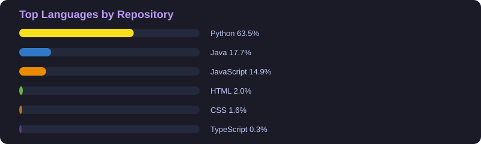
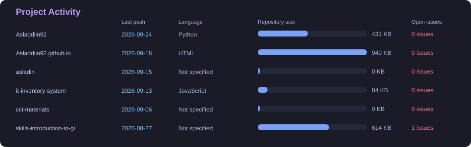
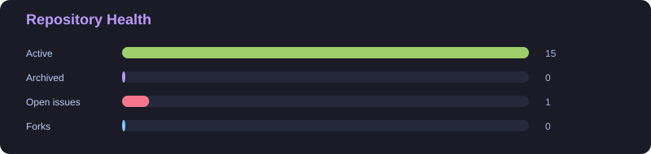
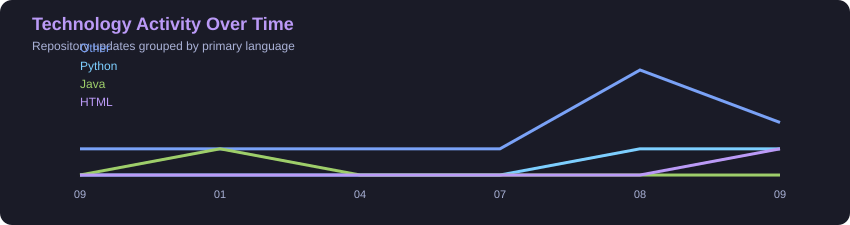
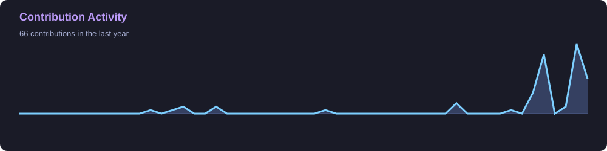
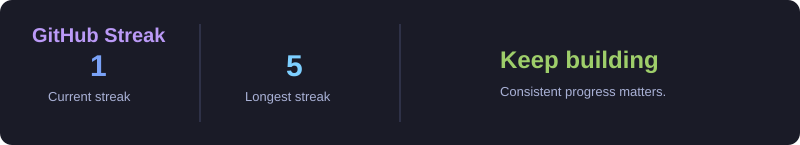

# Hi, I'm Asladdiin Abduqaadir 👋

### Full-Stack Developer | Java & Spring Boot | REST APIs | Database Design

I build practical software that solves real-world problems, with a focus on backend engineering, APIs, database-driven applications, and maintainable system architecture.

Currently studying **Information Technology at Haramaya University** while building and improving software projects across web, backend, and full-stack development.

---

## 🚀 Current Focus

Building full-stack applications with a focus on **Java & Spring Boot, REST APIs, database design, system architecture, and practical problem solving.**

- Backend development with Java and Spring Boot
- REST API design and integration
- Relational database design and SQL
- Application architecture and system design
- Full-stack web application development
- Building practical solutions for real users

---

## 🛠️ Tech Stack

### Backend

### Frontend

### Database

### Tools & Other Technologies

---

## 📌 Featured Projects

### 🎓 CCI Department Guidance

A student-focused decision-support application designed to help students identify suitable academic departments based on their academic performance and preferences.

**Focus:** Problem solving • User experience • Decision support

[View Repository →](https://github.com/Asladdiin92/cci-department-guidance)

---

### 💻 Personal Portfolio

A personal portfolio website created to showcase my projects, technical skills, experience, and development journey.

**Focus:** Web development • Responsive UI • Personal branding

[View Repository →](https://github.com/Asladdiin92/portfolio)

---

### 🔎 Blockchair T

A technical project focused on working with structured data and building practical software around data exploration and application development.

**Focus:** Data • Application development • Problem solving

[View Repository →](https://github.com/Asladdiin92/blockchair-t)

---

## 🧠 What I Enjoy Building

I am particularly interested in software that involves:

- Backend services and APIs
- Database-driven applications
- Full-stack web applications
- Automation and productivity tools
- Systems that solve practical problems
- Software for education and local communities

---

## 🎓 Education

**Bachelor of Science in Information Technology**

Haramaya University

---

## 📊 GitHub Analytics

  <strong>Recent activity, repository overview, and language distribution</strong>

  

  

  

  

  

  

  

  

<table align="center">
  <tr>
    <td align="center" valign="middle">
      
    </td>
    <td align="center" valign="middle">
      
    </td>
  </tr>
</table>

  Analytics are generated from GitHub data and updated automatically by GitHub Actions.

---

## 🤝 Let's Connect

- **GitHub:** [@Asladdiin92](https://github.com/Asladdiin92)
- **Email:** [asladdiinabduqaadir@gmail.com](mailto:asladdiinabduqaadir@gmail.com)
- **X:** [@asladin15](https://x.com/asladin15)
- **TikTok:** [@asladdiinabduqaadir](https://www.tiktok.com/@asladdiinabduqaadir)
- **Facebook:** [Profile](https://web.facebook.com/share/p/1D5MaiDJFF/)

I'm open to **collaboration, interesting software projects, and opportunities to learn and build useful products.**

---

  <i>Build. Learn. Improve. Repeat.</i>

