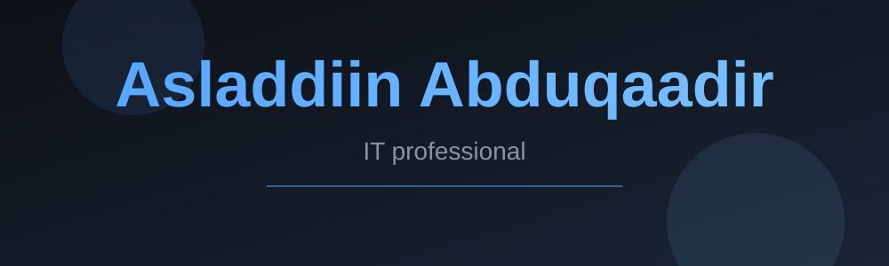
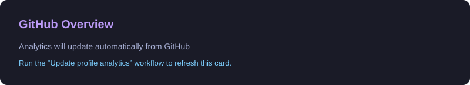

<p align="center">
  
</p>


[](https://github.com/Asladdiin92)
[](https://asladin.me)
[](mailto:asladdiinabduqaadir@gmail.com)
[](https://github.com/Asladdiin92/Asladdiin92/actions/workflows/update-profile-analytics.yml)

[Resume and portfolio](https://asladin.me)

---
<p align="center">  </p>

<p align="center">  </p>Full-Stack Developer · Java Backend · APIs · System Design · Databases


## ✅ Engineering Signals

[](https://github.com/Asladdiin92/Asladdiin92/actions/workflows/update-profile-analytics.yml)


## About Me

I'm an Information Technology student and developer focused on building real-world software systems.

My current engineering focus is:

* **Java backend development**
* **REST APIs and backend architecture**
* **System design**
* **Database design and data modeling**
* **Full-stack application development**
* **Problem solving and software engineering fundamentals**

I enjoy taking an idea from **requirements → architecture → implementation → database → API → user interface**.

---

## Engineering Focus

<table>
<tr>
<td width="50%">

### Backend Engineering

* Java & Spring Boot
* REST API design
* Authentication & authorization
* Service architecture
* Backend application design
* API integration

</td>
<td width="50%">

### Data & Systems

* Relational & NoSQL databases
* Database design
* Data modeling
* Redis & caching
* System design
* Application architecture

</td>
</tr>
</table>

---

## Featured Projects

### 🎓 CCI Department Guidance

A full-stack platform designed to help students navigate department-related guidance and information.

**Stack:** React · Node.js · Express · Supabase

[View Repository →](https://github.com/Asladdiin92/cci-department-guidance)

---

### 📧 Gmail-Native Mail Platform

A full-stack application exploring a Gmail-native workflow for receiving, processing, organizing, and managing messages through a custom application interface.

**Focus:** Google APIs · Backend Architecture · MongoDB · Authentication · Email Data Processing

> Currently evolving as a larger backend/full-stack engineering project.

---

### 💻 Developer Portfolio

My personal portfolio and developer landing page.

**Stack:** HTML · CSS · JavaScript

[Live Website →](https://asladin.me)
[Repository →](https://github.com/Asladdiin92/portfolio)

---

### 🔎 Blockchair T

A structured-data exploration and processing project focused on application design and data handling.

**Stack:** C++ · Data Processing · Application Design

[View Repository →](https://github.com/Asladdiin92/blockchair-t)

---

## 🛠️ Tech Stack

### Frontend


### Backend


### Database & Infra


### Tools & Monorepo


---

## Engineering Principles

```text
Design before implementation
Build for maintainability
Keep APIs predictable
Model data carefully
Solve problems systematically
Learn continuously
```

---

## GitHub Activity

<p align="center">
  
</p>

<p align="center">
  
</p>

---

## Education

**Bachelor of Science in Information Technology**
Haramaya University

---

## Let's Connect

If you're interested in collaborating on software projects, backend systems, APIs, or full-stack applications, feel free to reach out.

<p align="left">
  <a href="https://asladin.me">
    
  </a>
  <a href="mailto:asladdiinabduqaadir@gmail.com">
    
  </a>
</p>

---

<p align="center">
  <i>Build with purpose. Learn continuously. Improve every iteration.</i>
</p>
